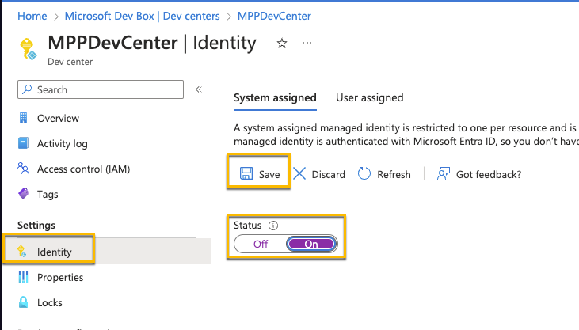
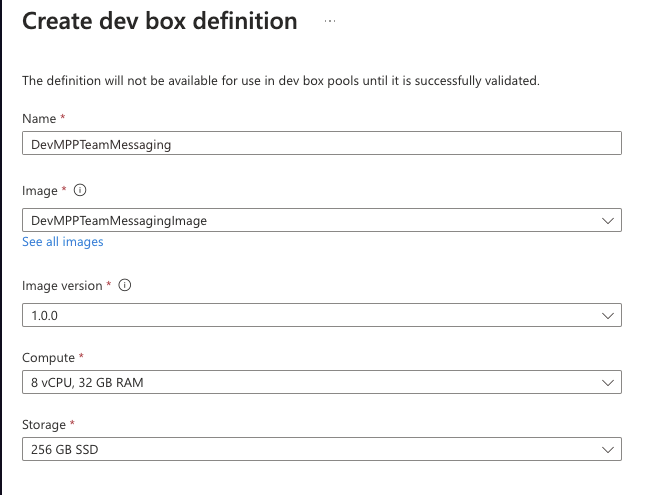
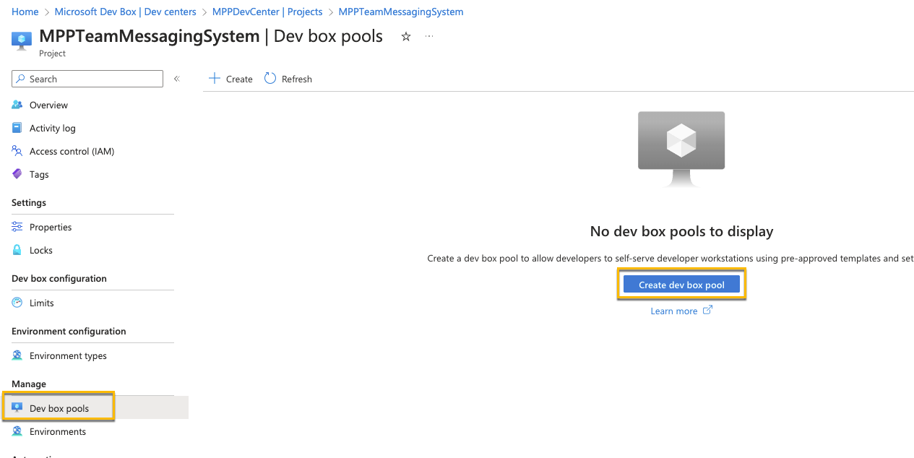
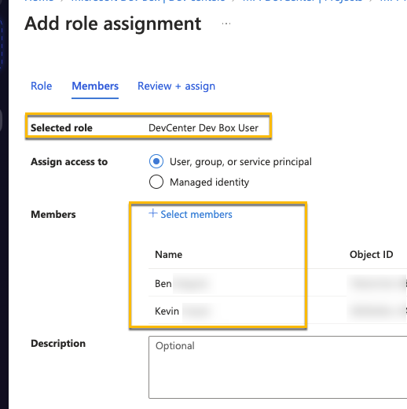

# Task 03 - Deploy a Microsoft Dev Box (10 minutes)

## Task 3 - Deploy a Microsoft Dev Box

1. Navigate back to your Dev Center, go to Identity and turn on a system assigned Managed Identity
   
2. Once it's been enabled, in the Dev Center and add the compute gallery that was created in Task 2
   
3. Go to you Dev box definitions, and create a new definition. Use the image you created in Task 2.
    -**Note**: The verification of the definition can also take some time to complete. If it hasn't completely after about 20 minute, students can proceed to continue on with exercise 2 and using their own machines. They can check on that status periodically, and once it completes, finish up Task 3. It's OK to use another machine (there own or another VM) for Day 1 and use the Dev Box on day 2.
   
4. After the definition has been created and the image status verified, go to Projects and open up your MPPTeamMessagingSystem Project
   
5. Navigate to Manage dev box pools, and create a dev box pool
   
6. Configure the settings as seen below. Use your Dev Box Image you just created as well as the network connection you created in Task 1. You may also want to adjust the auto-stop time
   
7. Finally, for the Project, under Access control, assign yourself and any other users to be a "DevCenter Dev Box Users"
    

**Notes:** At this point in time, Docker doesn't appear to work if it was installed on the image and may need an uninstall/re-install
